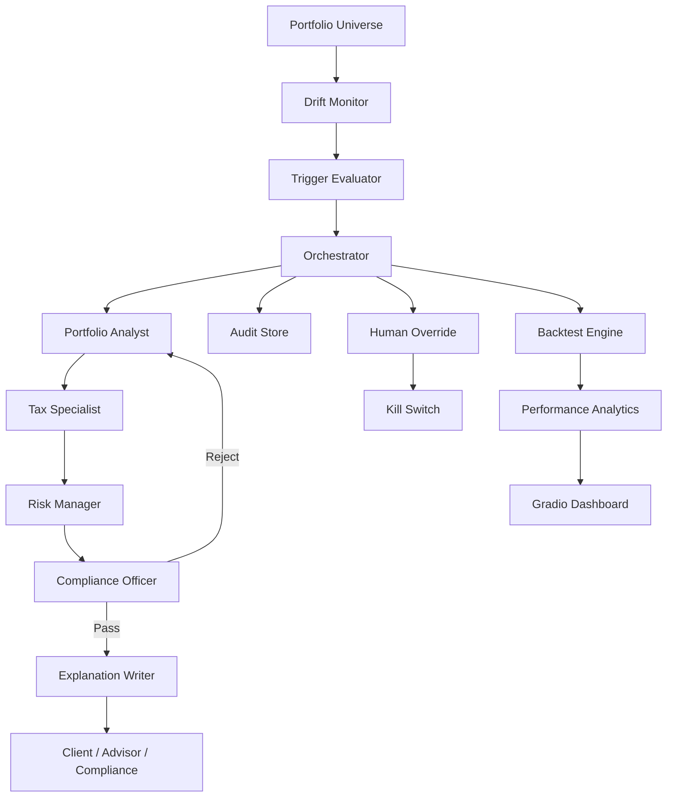

# WealthPilot AI — Autonomous Portfolio Rebalancing Agent

This repository is a free/local implementation of the Project 1D specification.

## User-requested adaptation

The source specification asks for a Streamlit dashboard. This version uses **Gradio**
instead, while preserving the source architecture and functionality.

The system is an educational simulation. It does not connect to a broker or place
real trades.

## Full scope implemented

- 50,000 synthetic portfolio universe
- 5 risk categories
- 6 asset classes
- vectorised drift monitoring
- threshold, calendar and event triggers
- CVXPY constrained optimisation
- trade-list generation
- transaction-cost estimation
- tax-lot-aware demo tax optimisation
- liquidity scoring
- specialist agent chain
- compliance validation and retry loop
- client/advisor/compliance explanations
- Groq API integration with local fallback
- deterministic explainability plus optional SHAP/LIME adapters
- human override
- kill switch
- SQLite audit trail
- 12-month synthetic backtesting
- legacy quarterly / threshold-only / buy-and-hold comparisons
- crash, V-recovery, rate-shock and custom stress scenarios
- compliance audit
- bias checks
- explanation quality scorecard
- five-view Gradio dashboard
- PDF report generation
- unit/integration/scenario tests
- GitHub Actions CI

## Asset classes

The PDF specification uses:

1. Indian Equities
2. International Equities
3. Indian Fixed Income
4. International Fixed Income
5. Alternatives
6. Cash / Liquid Instruments

## Risk categories

| Category | Equity | Fixed Income | Alternatives | Cash | Drift Band |
|---|---:|---:|---:|---:|---:|
| Ultra-Conservative | 15% | 60% | 10% | 15% | 2.0% |
| Conservative | 30% | 45% | 12% | 13% | 2.5% |
| Balanced | 50% | 30% | 12% | 8% | 3.0% |
| Aggressive | 70% | 15% | 10% | 5% | 4.0% |
| Ultra-Aggressive | 85% | 5% | 7% | 3% | 5.0% |

The detailed six-asset-class portfolio model is represented internally by splitting
the broad equity and fixed-income targets into Indian/international components.

## Install

```powershell
python -m venv .venv
.venv\Scripts\activate
pip install -r requirements.txt
copy .env.example .env
```

Add your Groq key to `.env`:

```env
GROQ_API_KEY=your_key_here
GROQ_MODEL=llama-3.3-70b-versatile
```

Never commit `.env`.

## Run

```powershell
python app.py
```

Then open the local Gradio URL.

## Tests

```powershell
pytest -q
```

## Generate the 50,000-portfolio universe

The UI generates it on demand. For a command-line dataset:

```powershell
python -m src.data.portfolio_generator
```

## Architecture



## Groq usage

Groq is deliberately limited to language generation. Numerical portfolio
calculations, constraints, costs, taxes and compliance rules are deterministic
Python functions. This prevents the LLM from inventing financial calculations.

If `GROQ_API_KEY` is empty, explanations are generated locally.

## Important

The source document describes regulatory and tax concepts. This educational
implementation is not a legal, tax, investment or regulatory compliance system.
Before any real-world deployment, all rules must be reviewed and validated by
qualified professionals and current regulations.
